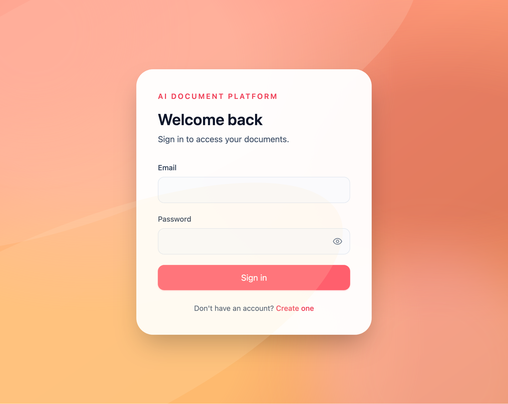
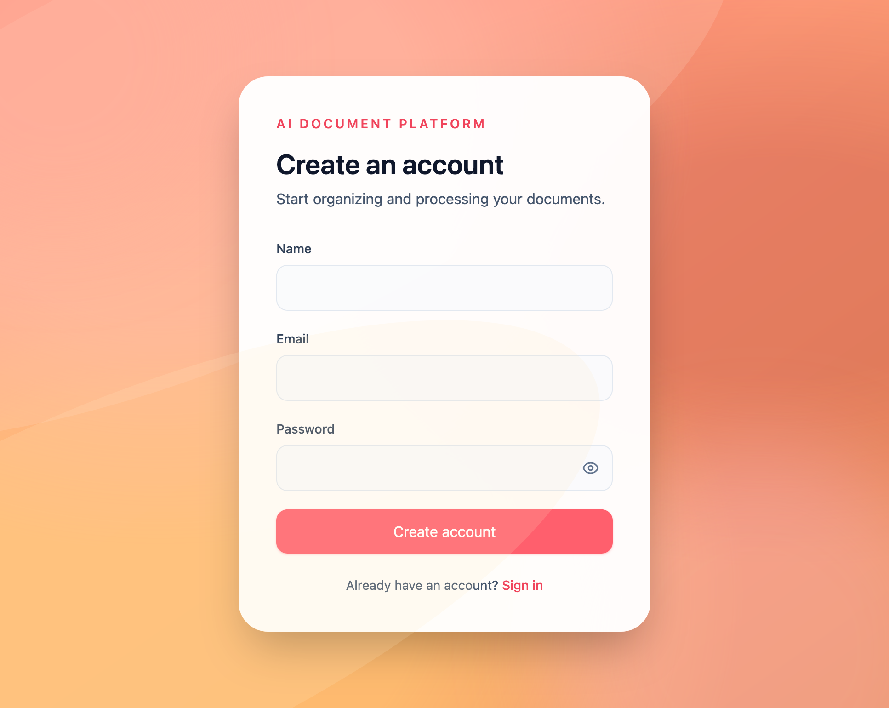
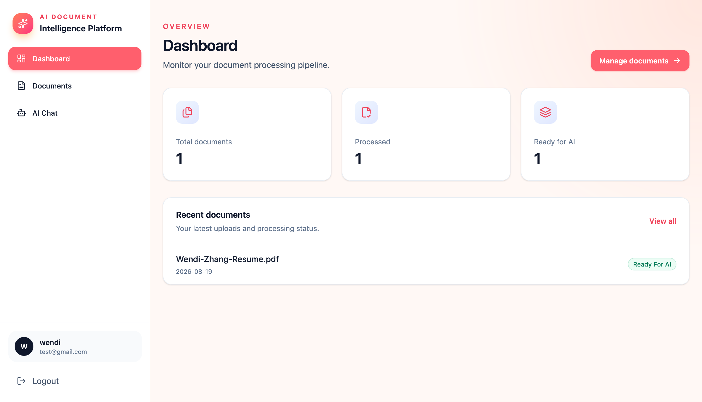
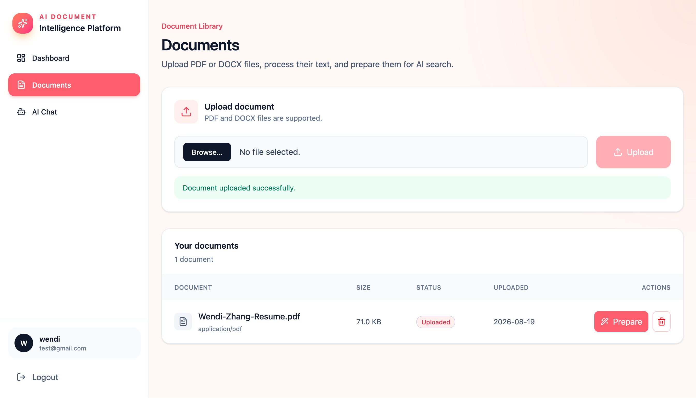
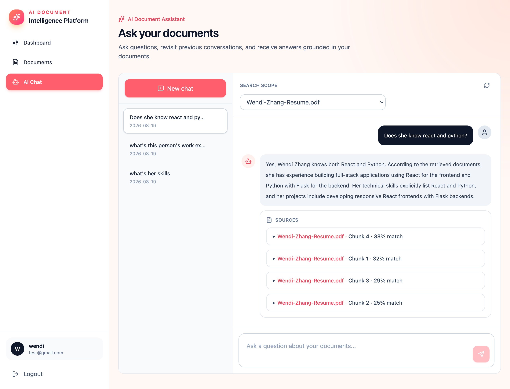

# AI Document Intelligence Platform

A full-stack document intelligence application built with React, TypeScript, FastAPI, PostgreSQL, pgvector, and OpenAI.

Users can upload PDF and DOCX files, process documents into vector embeddings, search document content, and ask questions using Retrieval-Augmented Generation (RAG).

The application includes JWT authentication, document management, semantic search, multi-turn AI chat, streaming responses, and user-specific data access.

## Live Demo

Application: http://16.54.70.41

API Documentation: http://16.54.70.41/docs

The current deployment uses HTTP. A custom domain and HTTPS are planned.

## Features

### Authentication

- User registration and login
- Password hashing
- JWT authentication
- Protected API endpoints
- Token expiration
- User-specific data access

### Document Management

- Upload PDF and DOCX files
- File type and file structure validation
- Upload size limits
- Text extraction
- Document chunking
- OpenAI embeddings
- Document processing status
- Delete documents

### Search and RAG

- PostgreSQL with pgvector
- Semantic vector search
- Cosine similarity
- Retrieval-Augmented Generation
- Search results limited to the authenticated user's documents
- Source references in AI responses

### AI Chat

- Multiple chat sessions
- Conversation history
- Follow-up questions
- Streaming AI responses
- Filter chat by document
- Saved user and assistant messages

## Tech Stack

### Frontend

- React
- TypeScript
- Vite
- React Router
- React Query
- Axios
- Tailwind CSS

### Backend

- Python
- FastAPI
- SQLAlchemy
- Alembic
- Pydantic
- JWT authentication
- Pytest

### AI and Database

- OpenAI API
- OpenAI embeddings
- Retrieval-Augmented Generation
- PostgreSQL
- pgvector
- Semantic search

### Deployment

- AWS EC2
- Docker
- Docker Compose
- Nginx
- GitHub Actions
- AWS Systems Manager
- CloudWatch
- Amazon S3

## Architecture

```text
AI Document Intelligence Platform
├── Frontend
│   ├── React
│   ├── TypeScript
│   └── Tailwind CSS
│
├── Backend
│   ├── FastAPI
│   ├── JWT authentication
│   ├── SQLAlchemy
│   └── Alembic
│
├── Document Processing
│   ├── PDF / DOCX text extraction
│   ├── Text chunking
│   ├── OpenAI embeddings
│   └── Semantic search
│
├── AI
│   ├── Retrieval-Augmented Generation
│   ├── Multi-turn chat
│   └── Streaming responses
│
└── Database
    ├── PostgreSQL
    └── pgvector
```

## Production Setup

```text
AWS EC2
├── Nginx
│   ├── React frontend
│   └── Reverse proxy for /api
│
├── Docker
│   ├── FastAPI backend
│   └── PostgreSQL + pgvector
│
├── Monitoring
│   ├── CloudWatch
│   └── SNS alerts
│
└── Backups
    ├── Daily PostgreSQL backup
    ├── Amazon S3
    └── 30-day retention
```

## CI/CD

GitHub Actions runs automatically when changes are pushed to `main`.

The workflow:

- Runs backend tests
- Starts PostgreSQL and pgvector for testing
- Builds the frontend
- Authenticates to AWS using OIDC
- Deploys to EC2 through AWS Systems Manager
- Rebuilds the Docker services
- Runs Alembic migrations
- Checks backend health
- Builds and deploys the frontend
- Reloads Nginx

Production deployments do not require long-lived AWS access keys in GitHub.

## Screenshots

### Login



### Register



### Dashboard



### Documents



### AI Chat



## Project Structure

```text
ai-document-platform/
├── backend/
│   ├── app/
│   │   ├── api/
│   │   ├── core/
│   │   ├── models/
│   │   ├── schemas/
│   │   ├── services/
│   │   └── main.py
│   ├── alembic/
│   ├── tests/
│   ├── Dockerfile
│   └── requirements.txt
│
├── frontend/
│   ├── src/
│   │   ├── api/
│   │   ├── components/
│   │   ├── hooks/
│   │   ├── pages/
│   │   └── types/
│   └── package.json
│
├── .github/
│   └── workflows/
│       └── ci.yml
│
├── docker-compose.yml
└── README.md
```

## Local Setup

### Clone the repository

```bash
git clone https://github.com/WendiZhang/ai-document-platform.git
cd ai-document-platform
```

### Backend

```bash
cd backend

python -m venv venv
source venv/bin/activate

pip install -r requirements.txt

cp .env.example .env
```

Update the values in `.env`, then start FastAPI:

```bash
uvicorn app.main:app --reload
```

Backend:

```text
http://127.0.0.1:8000
```

API documentation:

```text
http://127.0.0.1:8000/docs
```

### Frontend

```bash
cd frontend

npm install
cp .env.example .env
npm run dev
```

Frontend:

```text
http://localhost:5173
```

## Environment Variables

Backend:

```text
APP_NAME
APP_ENV
DEBUG
DATABASE_URL
JWT_SECRET_KEY
JWT_ALGORITHM
ACCESS_TOKEN_EXPIRE_MINUTES
OPENAI_API_KEY
UPLOAD_DIRECTORY
MAX_UPLOAD_SIZE_MB
```

Frontend:

```text
VITE_API_BASE_URL
```

Real environment files and production secrets are not committed to Git.

## Running Tests

From the backend directory:

```bash
pytest
```

Run a specific test file:

```bash
pytest tests/test_chat.py
```

The GitHub Actions workflow also runs the backend tests automatically before deployment.

## API Overview

### Authentication

```text
POST /api/auth/register
POST /api/auth/login
GET  /api/auth/me
```

### Documents

```text
POST   /api/documents/upload
GET    /api/documents
GET    /api/documents/{id}
DELETE /api/documents/{id}
POST   /api/documents/{id}/prepare
```

### Search

```text
POST /api/search/semantic
```

### Chat

```text
POST   /api/chat/sessions
GET    /api/chat/sessions
GET    /api/chat/sessions/{id}/messages
POST   /api/chat/sessions/{id}/messages
POST   /api/chat/sessions/{id}/stream
DELETE /api/chat/sessions/{id}
```

## Security

- Password hashing
- JWT authentication
- Token expiration and validation
- Protected API endpoints
- User-specific document access
- User-specific chat access
- User-isolated semantic search
- PDF and DOCX validation
- Upload size limits
- Randomized stored filenames
- FastAPI and PostgreSQL restricted to localhost in production
- Production secrets excluded from Git
- Debug mode disabled in production
- Nginx security headers
- Dependency vulnerability checks

## Monitoring and Backups

CloudWatch monitors the EC2 instance. A CPU alarm sends a notification when CPU usage remains above the configured threshold.

PostgreSQL is backed up automatically once per day. Backups are compressed and uploaded to a private S3 bucket.

Backups are automatically removed after 30 days.

The restore process was tested using a separate PostgreSQL database to verify that the schema and application data could be recovered.

## Future Improvements

- Custom domain and HTTPS
- Store uploaded documents in Amazon S3
- Hybrid vector and keyword search
- Reranking
- Background document processing
- OCR support
- Image extraction
- Additional application monitoring